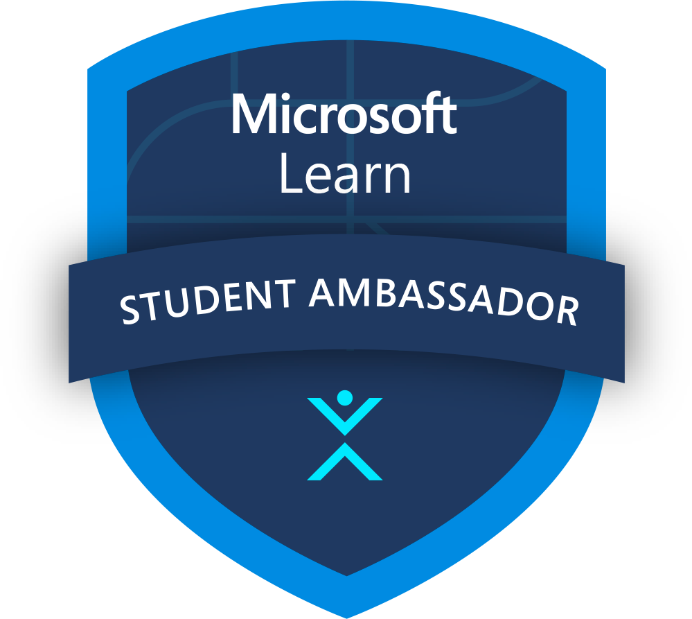

# Microsoft Student Champs

This is a sample React site created using Vite for a demo on **Integrating Serverless APIs and Authentication with Azure Static Web Apps**. The project was built as part of a practical session for the **Microsoft Learn Student Ambassador** program.



## Overview

This project demonstrates how to set up a React project using Vite, deploy it to GitHub, and host it using Azure Static Web Apps. It includes:
- A basic React app with two images (Azure and MLSA logos).
- A button that increments a counter using React state management.
- Informational content about integrating serverless APIs and authentication with Azure.

## Features
- **Vite**: A fast frontend build tool that helps you quickly develop React apps.
- **Azure Static Web Apps**: This project can be hosted on Azure Static Web Apps, leveraging GitHub Actions for CI/CD.
- **React**: The app uses React hooks to handle state (for the counter button).

## Getting Started

### 1. Clone the Repository

```bash
git clone https://github.com/Ahzem/Microsoft-Student-Champs.git
cd Microsoft-Student-Champs
```

### 2. Install Dependencies

Make sure you have Node.js installed, then run:

```bash
npm install
```

### 3. Run the Project

Start the development server:

```bash
npm run dev
```

The app will be running locally at `http://localhost:5173/`.

### 4. Deployment to Azure Static Web Apps

This app can be deployed to Azure Static Web Apps by:
1. Installing the **Azure Static Web Apps** extension in VS Code.
2. Linking the app to a GitHub repository.
3. Using the default configuration for React apps to deploy it to Azure.

## Project Structure

- **src**: Contains the main React component (`App.jsx`).
- **public**: Includes the static assets (images for Azure and MLSA logos).
- **App.css**: Styles for the app.

## Usage

- **Counter Button**: Click the button to see the count increase.
- **Logos and Links**: Click on the logos to visit the official Vite and React websites.
- **Informational Content**: Learn more about Microsoft Learn Student Ambassadors and Azure Static Web Apps.


## Resources

- [Vite](https://vitejs.dev)
- [React](https://react.dev)
- [Azure Static Web Apps](https://azure.microsoft.com/en-us/services/app-service/static/)
- [Microsoft Learn Student Ambassadors](https://studentambassadors.microsoft.com/)